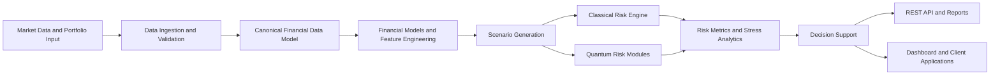

# Sigma

## Hybrid Quantum-Classical Risk Intelligence for Financial Decision-Making

Sigma is a research and engineering project for building a hybrid quantum-classical financial risk intelligence system. Its purpose is to help users understand uncertainty in portfolios and other financial exposures, quantify tail risk, evaluate future scenarios, and make better-informed decisions.

Sigma is not designed around the assumption that a quantum algorithm must replace an established classical optimizer. The project treats quantum computing as a specialized computational layer inside a broader, auditable risk-engineering workflow. Classical methods provide the baseline, validation, and decision layer; quantum methods are introduced where they can contribute to probability estimation, scenario generation, risk analytics, or selected hard optimization problems.

> **Project status:** Early-stage architecture and research definition. The repository currently does not contain a runnable production implementation. The interfaces, modules, and roadmap described below define the intended system and will be implemented incrementally.

---

## 1. Vision

Financial decisions are decisions under uncertainty. A portfolio is exposed not only to expected return and covariance, but also to market regimes, nonlinear dependencies, liquidity constraints, credit events, volatility changes, and extreme tail scenarios.

Sigma aims to become a modular risk intelligence engine that follows this principle:

```text
Financial data
    -> normalized market and portfolio state
    -> probability models and future scenarios
    -> loss distribution
    -> VaR, CVaR, stress, and exposure analytics
    -> decision support through APIs and reports
```

The long-term objective is a credible hybrid platform in which quantum methods are evaluated as part of a complete financial workflow rather than presented as isolated demonstrations.

## 2. Problem Statement

Many quantum-finance demonstrations start with a small portfolio and directly encode a Markowitz optimization problem as a QUBO or Ising model. This is useful for learning and benchmarking, but it does not by itself establish practical quantum advantage. Classical commercial and open-source solvers are already highly capable for many standard portfolio optimization problems.

Sigma therefore focuses first on a more fundamental question:

> How can a financial decision-maker understand the distribution of possible future outcomes and the risk of adverse scenarios more accurately, transparently, and efficiently?

This leads to a risk-first architecture based on:

- historical and market data processing;
- probabilistic and financial scenario models;
- classical Monte Carlo as a reference implementation;
- quantum Monte Carlo and amplitude-estimation research modules;
- VaR, CVaR/Expected Shortfall, stress testing, and exposure analysis;
- portfolio decision support built on top of measured risk;
- reproducible comparisons between classical and quantum approaches.

## 3. Core Design Principles

### Hybrid by design

Sigma combines classical financial engineering with quantum algorithms. No component is considered valuable merely because it is quantum; it must be evaluated within the end-to-end workflow.

### Risk before optimization

Portfolio optimization is only meaningful when the underlying uncertainty and loss distribution are understood. Sigma prioritizes scenario generation and risk measurement before advanced portfolio selection.

### Classical baselines are mandatory

Every quantum module must have a classical reference implementation. Results should be compared on accuracy, runtime, scalability, reproducibility, resource requirements, and practical usefulness.

### No unsupported quantum-advantage claims

The project will not claim quantum speedup or quantum advantage without an explicit benchmark, a well-defined problem size, a fair classical baseline, and a reproducible experimental protocol. Simulated results are not treated as evidence of production-level advantage.

### Auditable and explainable outputs

Risk results should be traceable to their data, model assumptions, confidence level, scenario set, and calculation method. Users must be able to understand why a risk measure changed.

### Modular architecture

Data providers, financial models, scenario generators, risk metrics, quantum backends, APIs, and user interfaces should remain replaceable. Research experiments must not make the core risk workflow dependent on one vendor, framework, or hardware provider.

## 4. Initial Product Definition

The first practical slice of Sigma is **Portfolio Market Risk Intelligence**.

### V1 workflow

```text
CSV or market-data provider
    -> ingestion and validation
    -> returns, volatility, and dependency estimation
    -> portfolio valuation and scenario generation
    -> classical Monte Carlo risk baseline
    -> VaR, CVaR, expected loss, and stress tests
    -> optional quantum benchmark module
    -> API response, report, or dashboard
```

### V1 inputs

- historical prices or returns;
- asset identifiers and timestamps;
- portfolio positions or portfolio weights;
- valuation date and investment horizon;
- confidence levels such as 95% or 99%;
- scenario and simulation configuration;
- optional market-data-provider configuration.

### V1 outputs

- portfolio return and loss distributions;
- Value at Risk (VaR);
- Conditional Value at Risk (CVaR), also called Expected Shortfall;
- expected loss and tail-loss statistics;
- stress-test results;
- asset-level and portfolio-level risk contribution;
- model and configuration metadata;
- classical-versus-quantum benchmark results where applicable.

The first version should be useful with public data and should remain understandable to a portfolio manager, risk analyst, researcher, or developer integrating the system through an API.

## 5. System Architecture



### 5.1 Data layer

The data layer is responsible for ingestion, normalization, validation, and provenance. It should support multiple sources without coupling the risk engine to a specific provider.

The initial input contract may support a simple historical-price file such as:

| Field | Description |
| --- | --- |
| `Date` | Observation date or timestamp |
| `Ticker` | Asset identifier |
| `Close` | Closing or valuation price |
| `Volume` | Optional traded volume |

Important data operations include missing-value handling, duplicate detection, timestamp alignment, corporate-action treatment, return calculation, outlier checks, and validation of portfolio weights.

### 5.2 Financial model layer

This layer transforms normalized observations into model-ready quantities, including:

- simple or logarithmic returns;
- expected-return estimates;
- volatility and covariance or correlation matrices;
- factor exposures and regime features;
- price, rate, volatility, and credit models when required;
- model assumptions and calibration metadata.

Candidate model families include geometric Brownian motion, stochastic-volatility models such as Heston, interest-rate models such as CIR or Hull-White, and credit-risk models. The initial release should use a small, well-tested subset rather than attempt to support every model at once.

### 5.3 Scenario-generation layer

The scenario engine converts model assumptions into possible future market states and portfolio outcomes. It should provide a common interface for:

- historical simulation;
- parametric simulation;
- classical Monte Carlo;
- quantum Monte Carlo research experiments;
- learned or generative probability distributions.

The engine must preserve scenario metadata so that every risk result can be traced back to the model, random seed, horizon, number of paths, and transformation applied.

### 5.4 Classical risk engine

The classical engine is the reference implementation and the minimum viable analytical core. It should calculate:

- portfolio valuation under each scenario;
- profit-and-loss distributions;
- VaR at configurable confidence levels;
- CVaR/Expected Shortfall;
- volatility and drawdown statistics;
- sensitivity and concentration measures;
- historical and hypothetical stress tests;
- risk contributions by asset, factor, or position.

For a loss random variable (L), VaR at confidence level α is the corresponding quantile:

```text
VaR_α(L) = inf { l : P(L <= l) >= α }
```

CVaR measures the expected loss in the tail beyond that threshold:

```text
CVaR_α(L) = E[L | L >= VaR_α(L)]
```

The exact estimator and treatment of discrete samples must be documented and tested.

### 5.5 Quantum layer

The quantum layer is an optional, bounded module that consumes well-defined probability or optimization subproblems from the classical workflow.

Potential research directions include:

| Method | Intended role in Sigma | Maturity in the project |
| --- | --- | --- |
| Quantum Monte Carlo | Explore quantum-assisted scenario and expectation estimation | Research direction |
| QAE, IQAE, or MLQAE | Estimate probabilities, expectations, and risk quantities | Research direction |
| qGAN or related generative models | Study learned probability-distribution loading | Research direction |
| QAOA or SamplingVQE | Benchmark selected constrained portfolio or combinatorial problems | Research direction |
| Quantum kernels or similarity models | Explore nonlinear dependency representations | Future research |

The quantum layer must expose the same analytical contract as the classical baseline wherever possible. This makes it possible to compare equivalent outputs instead of comparing unrelated demonstrations.

### 5.6 Decision-support layer

Sigma does not need to make autonomous investment decisions in its first version. Its decision-support layer should present:

- the risk profile of a portfolio;
- the main drivers of risk;
- the effect of alternative scenarios;
- the impact of changing weights or constraints;
- possible risk-reduction actions;
- limitations and assumptions of the selected model.

Portfolio optimization may be added as a downstream consumer of risk analytics. A general Markowitz objective can be written as:

```text
maximize    μᵀw - q wᵀΣw
subject to  portfolio and regulatory constraints
```

Here, `μ` represents expected returns, `Σ` represents the dependency structure, `w` represents portfolio weights, and `q` represents risk aversion. This formulation is a baseline, not the complete identity of Sigma.

## 6. API Direction

Sigma is intended to be API-first so that its analytical engine can serve dashboards, notebooks, internal tools, and external client applications.

Proposed endpoints include:

```text
POST /risk/estimate
POST /risk/scenario
POST /risk/stress-test
POST /portfolio/analyze
GET  /health
```

An illustrative request for `POST /risk/estimate` could contain:

```json
{
  "assets": ["AAPL", "MSFT", "NVDA"],
  "weights": [0.30, 0.35, 0.35],
  "horizon_days": 10,
  "confidence_levels": [0.95, 0.99],
  "method": "classical_monte_carlo",
  "num_scenarios": 100000
}
```

An illustrative response could contain:

```json
{
  "var": {
    "0.95": 0.042,
    "0.99": 0.071
  },
  "cvar": {
    "0.95": 0.058,
    "0.99": 0.094
  },
  "expected_loss": 0.012,
  "risk_level": "high",
  "method": "classical_monte_carlo",
  "model_version": "v1"
}
```

These examples describe the intended contract only; they are not currently implemented endpoints.

## 7. Portfolio Optimization and Classical Solvers

Portfolio optimization remains an important Sigma capability, but it must be placed in the correct context.

Standard portfolio problems can often be solved effectively by mature classical optimization software such as Gurobi, CPLEX, MOSEK, or specialized heuristics. Sigma should therefore:

1. implement a transparent classical baseline;
2. support realistic constraints such as cardinality, sectors, transaction costs, liquidity, and lot sizes;
3. formulate an equivalent quantum problem only where the problem structure justifies it;
4. compare objective quality, feasibility, runtime, scalability, and resource requirements;
5. report the result without assuming that the quantum method wins.

Potentially more interesting research problems include higher-order portfolio objectives, nonlinear risk penalties, and optimization under complex operational constraints. These are research directions and should not be presented as production capabilities until they are implemented and independently benchmarked.

## 8. Validation and Benchmarking

Trustworthy risk analytics requires more than a visually convincing result. Each module should be evaluated using:

- deterministic tests for mathematical transformations;
- synthetic data with known distributions;
- historical backtesting where appropriate;
- convergence tests over simulation count;
- sensitivity analysis for model assumptions;
- reproducible random seeds and configuration snapshots;
- comparison with trusted classical libraries or reference calculations;
- performance measurements across increasing problem sizes;
- error, precision, qubit-count, circuit-depth, and noise analysis for quantum experiments.

Quantum experiments should distinguish clearly between:

- ideal statevector simulation;
- noisy simulation;
- sampled simulator execution;
- execution on real quantum hardware;
- fault-tolerant resource estimates.

These are different experimental conditions and must not be treated as interchangeable.

## 9. Security, Governance, and Model Risk

Although Sigma begins as a research project, a financial risk engine must be designed with operational discipline. Future implementation should account for:

- input validation and safe handling of uploaded files;
- authentication and authorization for API access;
- protection of sensitive portfolio data;
- audit logs for requests, models, and outputs;
- versioned model configurations;
- reproducible reports;
- clear separation between research and production backends;
- monitoring for data drift and model degradation;
- explicit disclaimers that analytical outputs are not financial advice.

Model limitations should be returned with the result or included in the report. A risk number without its assumptions is incomplete.

## 10. Planned Technology Direction

The initial implementation is expected to prioritize Python for research velocity and interoperability:

- Python for orchestration and analytical modules;
- NumPy, pandas, SciPy, and related scientific tooling;
- QuantLib-Python for selected financial models;
- Qiskit and compatible quantum simulators/backends for quantum experiments;
- FastAPI for the service layer;
- PostgreSQL or DuckDB for structured data, depending on deployment needs;
- Plotly, Streamlit, or a separate web client for visualization.

This is a planned technology direction, not a statement that these dependencies are already configured in the repository. Performance-critical components may be rewritten in C++, Rust, or another suitable systems language only after profiling identifies a real bottleneck.

## 11. Roadmap

### Phase 0 — Foundation

- define the canonical data and portfolio schemas;
- define calculation conventions and configuration formats;
- establish test, logging, and reproducibility standards;
- document assumptions and supported input types.

### Phase 1 — Classical Market-Risk MVP

- ingest a validated CSV dataset;
- calculate returns, volatility, and dependencies;
- generate historical and classical Monte Carlo scenarios;
- calculate VaR, CVaR, expected loss, and stress results;
- produce a reproducible report.

### Phase 2 — Service and Visualization

- expose the risk engine through a versioned API;
- add request validation and result metadata;
- provide a minimal dashboard or report viewer;
- support multiple portfolios and configurations.

### Phase 3 — Quantum Benchmark Module

- define a probability-estimation or expectation-estimation subproblem;
- implement a classical reference and quantum experiment;
- evaluate QAE/QMC-related workflows under explicit resource limits;
- compare accuracy, runtime, sampling cost, and hardware constraints;
- publish limitations alongside results.

### Phase 4 — Advanced Risk and Optimization

- add credit portfolio risk and expected-loss analytics;
- explore option pricing and other financial risk modules;
- add constrained and risk-aware portfolio optimization;
- investigate learned distributions, nonlinear dependencies, and higher-order objectives.

### Phase 5 — Production Readiness

- harden data connectors and persistence;
- add authentication, authorization, observability, and auditability;
- profile and optimize bottlenecks;
- define deployment, governance, and model-validation procedures.

## 12. Repository Status and Expected Structure

Sigma is currently in the architecture and research-definition stage. The implementation will be organized around independent modules rather than a single notebook or a single quantum algorithm.

An intended structure is:

```text
sigma/
├── README.md
├── src/
│   └── sigma/
│       ├── data/
│       ├── models/
│       ├── scenarios/
│       ├── monte_carlo/
│       ├── risk/
│       ├── quantum/
│       ├── portfolio/
│       └── api/
├── tests/
├── notebooks/
├── examples/
└── pyproject.toml
```

The exact structure may evolve as implementation begins. The important boundary is that the quantum layer remains a replaceable component of the risk platform.

## 13. What Sigma Is — and Is Not

### Sigma is

- a hybrid quantum-classical financial risk intelligence project;
- a modular engine for scenario analysis and tail-risk measurement;
- a research platform for QMC, QAE, and related quantum-finance methods;
- an API-oriented foundation for portfolio and credit-risk analytics;
- a benchmarkable system that values classical comparability and transparency.

### Sigma is not yet

- a production banking risk platform;
- a replacement for Gurobi, CPLEX, QuantLib, ORE, or established institutional systems;
- evidence of quantum advantage;
- an autonomous investment adviser;
- a complete portfolio-management, order-management, or execution system;
- a runnable package in its current repository state.

## 14. Responsible Interpretation

Sigma is an engineering and research project. Its outputs are intended for experimentation, education, benchmarking, and future decision-support workflows. They must not be interpreted as financial advice or as a guarantee of investment performance.

Any future production use would require independent validation, appropriate data governance, security controls, regulatory review, and domain-expert oversight.

## 15. License and Contributions

The license has not yet been selected. Contribution, citation, and release guidelines will be added when the first implementation is published.

Until then, Sigma should be understood as a focused project blueprint: a risk-first path toward practical quantum finance, where the quality of the financial workflow matters as much as the quantum algorithm inside it.
