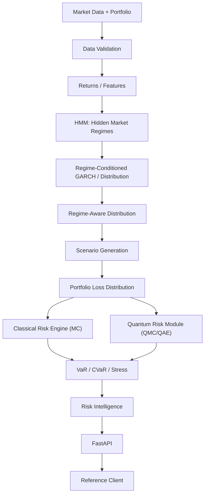
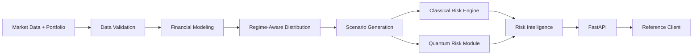

# SIGMA

```text
███████╗ ██╗  ██████╗ ███╗   ███╗  █████╗
██╔════╝ ██║ ██╔════╝ ████╗ ████║ ██╔══██╗
███████╗ ██║ ██║  ███╗ ██╔████╔██║ ███████║
╚════██║ ██║ ██║   ██║ ██║╚██╔╝██║ ██╔══██║
███████║ ██║ ╚██████╔╝ ██║ ╚═╝ ██║ ██║  ██║
╚══════╝ ╚═╝  ╚═════╝  ╚═╝     ╚═╝ ╚═╝  ╚═╝
```

**Hybrid Quantum–Classical Risk Intelligence**

Sigma is a research and engineering effort to build a **Financial Risk Intelligence Engine** that combines financial modeling, statistical methods, classical computation, and quantum computing — not for the sake of using quantum, but to build a risk analysis system that is verifiable, reproducible, and practically useful.

---

## Overview

Finance is decision-making under uncertainty. Sigma turns market data and portfolio information into explainable risk metrics and analysis.

Sigma is built to answer questions such as:

- What risks is this portfolio currently exposed to?
- Which scenarios could produce large losses?
- How large is the tail risk of the loss distribution?
- Which assets or factors contribute most to risk?
- How do classical and quantum methods compare in accuracy, computational cost, and practical feasibility?

The V1 focus is a **Regime-Aware Portfolio Risk Intelligence Engine**:


```mermaid
flowchart TD
    DATA["Market Data + Portfolio"] --> VALIDATE["Data Validation"]
    VALIDATE --> RETURNS["Returns / Features"]
    RETURNS --> REGIME["HMM: Hidden Market Regimes"]
    REGIME --> VOL["Regime-Conditioned GARCH / Distribution"]
    VOL --> DIST["Regime-Aware Distribution"]
    DIST --> SCENARIO["Scenario Generation"]
    SCENARIO --> LOSS["Portfolio Loss Distribution"]
    LOSS --> CLASSICAL["Classical Risk Engine (MC)"]
    LOSS --> QUANTUM["Quantum Risk Module (QMC/QAE)"]
    CLASSICAL --> RISK["VaR / CVaR / Stress"]
    QUANTUM --> RISK
    RISK --> INTEL["Risk Intelligence"]
    INTEL --> API["FastAPI"]
    API --> CLIENT["Reference Client"]
```

---

## Design Principles

### Classical First

Every quantum method must have a corresponding classical method as a benchmark baseline. Classical risk analysis is the foundation of Sigma and must work independently of quantum capability.

### Quantum Where Justified

Quantum is treated as a **computational enhancement layer**, not the essence of the product. It is introduced only when there is a clear financial problem and a sound reason to study its contribution.

### Fair Benchmark

Classical and quantum methods are evaluated on the **same financial problem, data, portfolio, confidence level, horizon, and experimental conditions**.

### No Unsubstantiated Quantum Advantage Claims

Theoretical speedups or circuit-level results are not evidence of end-to-end quantum advantage. Evaluation considers accuracy, runtime, sampling/query cost, state preparation cost, oracle cost, qubit count, circuit depth, shots, noise effects, and scalability.

### Reproducibility

Results must be traceable to their data, model, configuration, code version, and experiment.

### Measured Value

A method is only meaningful to the product when it produces measurable practical value — not just a technical demonstration.

---

## Key Features

- **Regime-aware modeling** — HMM infers latent market regimes from returns, feeding regime-conditioned distributions (research center)
- **Scenario generation** — Monte Carlo and stress scenario engines
- **Portfolio loss distribution** — scenario propagation into portfolio P&L and loss
- **Risk metrics** — VaR, CVaR / Expected Shortfall, Expected Loss, Stress Loss, Risk Contribution
- **Quantum estimation** — Quantum Monte Carlo and Quantum Amplitude Estimation as a research layer
- **Classical–Quantum benchmark** — fair, documented comparison on identical problem settings, per market regime
- **Core research engine** — research-first: API/UI integration is deferred to a later phase (FastAPI boundary designed but not built yet)

---

## Architecture

Sigma V1 is organized as a **modular monolith**. The core research engine
is built and tested first; the API-first boundary is designed but its
integration (FastAPI, reference client) is **deferred** to a later phase.

```text
Sigma Core (research & core engine — current focus)
  ├── Domain
  ├── Data
  ├── Modeling  (HMM regime layer · regime-conditioned GARCH)
  ├── Scenarios
  ├── Risk
  └── Quantum
```

Deferred integration layers (designed, not yet built):

```text
Client
  ↓ HTTP
FastAPI
  ↓
Application Layer
  ↓
Sigma Core
```

Architectural boundaries:

- UI / clients interact with the system **only through the HTTP API**
- FastAPI is the integration boundary and holds no financial computation
- The Classical Risk Engine operates independently of the quantum layer
- Risk concepts are independent of how they are estimated
- Qiskit code stays within the quantum module; core financial logic does not depend on it
- Domain and core modules do not depend on FastAPI, the UI framework, or quantum SDKs


```mermaid
flowchart LR
    A["Market Data + Portfolio"] --> B["Data Validation"]
    B --> C["Financial Modeling"]
    C --> D["Regime-Aware Distribution"]
    D --> E["Scenario Generation"]
    E --> F["Classical Risk Engine"]
    E --> G["Quantum Risk Module"]
    F --> H["Risk Intelligence"]
    G --> H
    H --> I["FastAPI"]
    I --> J["Reference Client"]
```

When integrated later, the reference client is planned as a Taipy-based
dashboard — a replaceable client that the core and API contract do not
depend on. UI work is deferred; the research engine is the current focus.

---

## Repository Structure

```text
sigma/
├── src/sigma/
│   ├── domain/        # Financial concepts (portfolio, market data, scenarios)
│   ├── data/          # Data loading, validation, snapshots
│   ├── modeling/      # Returns, HMM regime, regime-conditioned GARCH, distribution
│   ├── scenarios/     # Monte Carlo and stress scenario generation
│   ├── risk/          # VaR, CVaR, risk metrics, risk contribution
│   ├── quantum/       # State preparation, oracle, amplitude estimation
│   ├── application/   # Workflow orchestration
│   └── api/           # FastAPI boundary (routes, schemas)
├── ui/                # Reference client (Taipy dashboard)
├── research/          # Notebooks and experiments (not runtime code)
├── data/
│   ├── raw/
│   ├── processed/
│   └── artifacts/
├── configs/           # YAML model / scenario / benchmark configuration
├── tests/
│   ├── unit/
│   ├── integration/
│   └── evaluation/
├── docs/              # PRD, architecture, schema, rules, ADRs
└── pyproject.toml
```

---

## Getting Started

### Requirements

- Python `3.12` (`>=3.12.11,<3.13`)
- [uv](https://docs.astral.sh/uv/) as the package and environment manager
- Git

### Installation

```bash
uv sync
```

### Run the tests

```bash
uv run pytest
```

### Quality checks

```bash
uv run ruff check .
uv run ruff format --check .
uv run pyright
```

Or run the full pre-PR gate:

```bash
make check
```

### Start the API server

```bash
uv run uvicorn sigma.api.main:app --reload
```

Interactive API documentation is available at the served `/docs` endpoint.

### Download market data

Market data is managed through a versioned universe configuration and immutable local snapshots:

```bash
uv run python -m sigma.data.download --universe configs/universe.yaml
```

---

## Roadmap

- **Classical Risk Core** — data pipeline, returns, HMM regime layer, regime-conditioned GARCH, scenario generation, Monte Carlo, VaR/CVaR, stress testing
- **Quantum Benchmark** — financial quantity formulation, state preparation, oracle construction, QAE/QMC experiments, fair classical–quantum comparison **per market regime**
- **Advanced Research** — richer regime-aware distributions, MS-GARCH as future extension, quantum regime-transition encoding
- **API & Client** (deferred) — FastAPI boundary, application layer, reference dashboard, visualization
- **Productization** — persistence, observability, auditability, model governance

---

## Documentation

Detailed documentation lives in [`docs/`](docs/):

| Document | Scope |
|---|---|
| `PRD.md` | What and why |
| `ARCHITECTURE.md` | System structure and boundaries |
| `SCHEMA.md` | Data meaning and contracts |
| `RULES.md` | Engineering and research guardrails |
| `TECH_STACK.md` | Technology choices and rationale |
| `ADR/` | Architectural decision records |

---

## Contributing

See [`CONTRIBUTING.md`](CONTRIBUTING.md) for contribution guidelines: branch naming, commit conventions, testing expectations, and the research → validate → stabilize → test promotion flow.

Key expectations:

- Follow the **Classical First** principle; every quantum contribution needs a classical baseline
- Negative and inconclusive results are valid research outcomes
- Never claim quantum advantage without supporting evidence
- Keep architecture boundaries intact: clients talk to the API, not the core

---

## License

Copyright © 2026 Quantstellar Technologies.

This project is proprietary software. All rights reserved.

See [LICENSE](./LICENSE) for the full license terms.