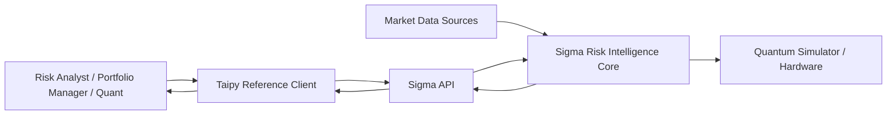
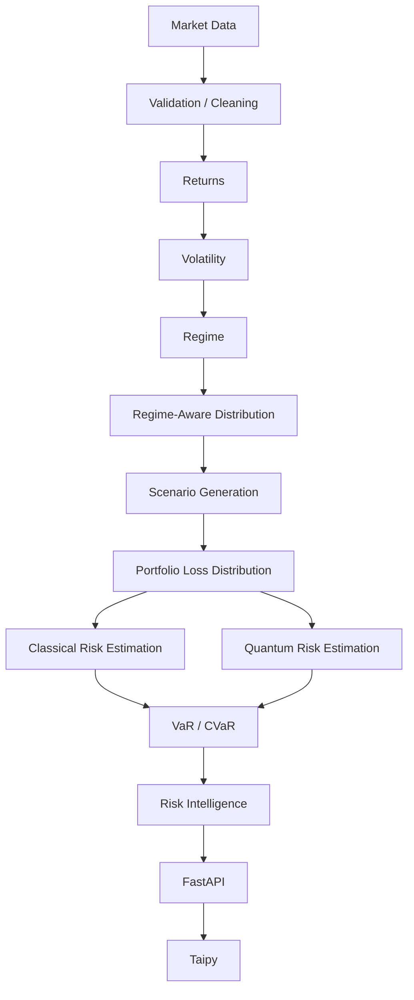
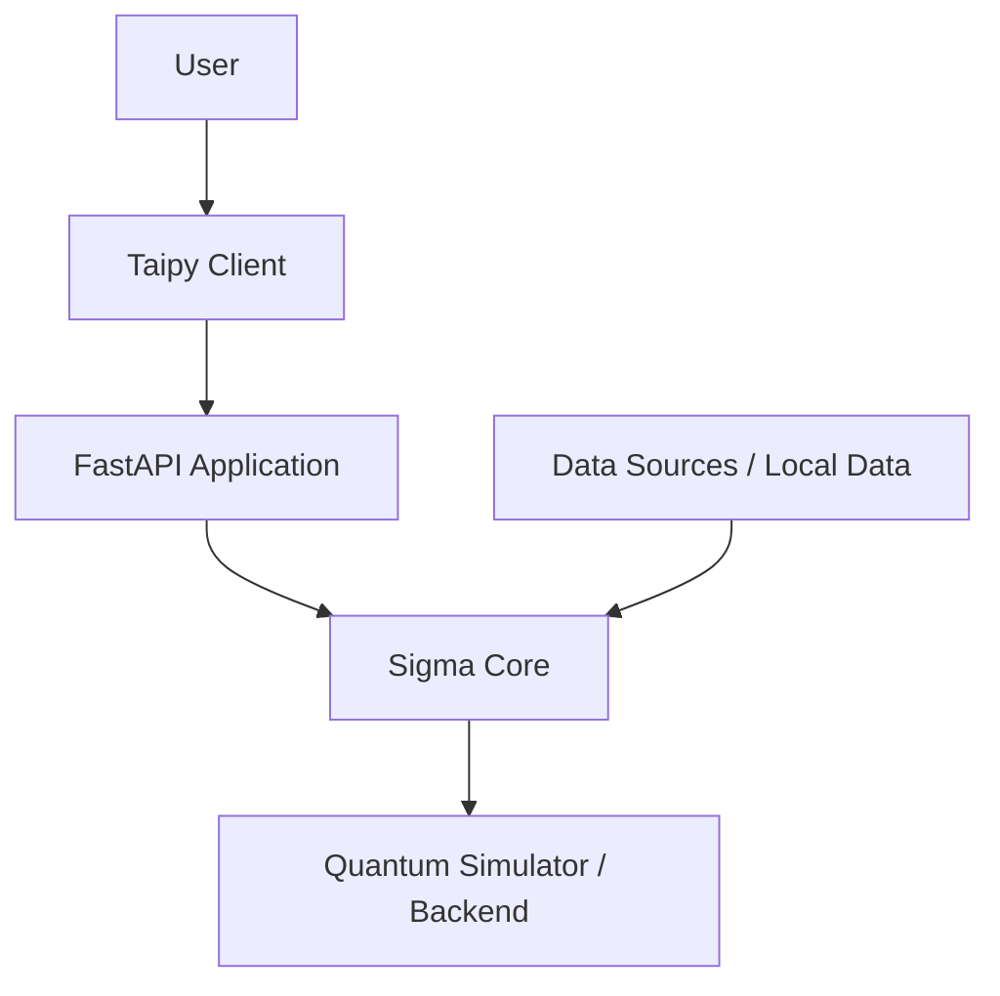

# Sigma — Kiến trúc hệ thống

**Phiên bản:** 0.2  
**Trạng thái:** Draft / Internal Baseline  
**Sản phẩm:** Sigma Risk Intelligence  
**Kiến trúc:** Modular Monolith  
**API:** FastAPI  
**Reference Client:** Taipy

---

## 1. Mục đích

`ARCHITECTURE.md` mô tả kiến trúc hệ thống của Sigma: cấu trúc module, trách nhiệm, hướng phụ thuộc, luồng dữ liệu và ranh giới giữa Core, API, giao diện và Research.

Các tài liệu liên quan:

- `SCHEMA.md` — cấu trúc dữ liệu và domain semantics.
- `TECH_STACK.md` — lựa chọn công nghệ.
- `RULES.md` — quy tắc và ràng buộc của dự án.

---

## 2. Định hướng kiến trúc

Sigma V1 sử dụng **Modular Monolith** với một Risk Intelligence Core, một API boundary ổn định và các client có thể thay thế.

```text
Research
   ↓
Sigma Core
   ↓
Application
   ↓
FastAPI
   ↓
Taipy / External Clients
```

Nguyên tắc chính:

> **Một repository → module rõ ràng → ranh giới rõ ràng → API-first → client có thể thay thế.**

Sigma V1 **không** sử dụng microservices.

Mục tiêu là giữ hệ thống đơn giản để phát triển và nghiên cứu nhanh, nhưng đủ rõ ràng để có thể mở rộng khi xuất hiện nhu cầu thực tế.

---

## 3. Nguyên tắc kiến trúc

### 3.1. Modular Monolith

Toàn bộ Sigma V1 nằm trong một repository và application boundary chính.

Các module được tách theo trách nhiệm, không tách thành service độc lập chỉ để tạo kiến trúc phức tạp.

**Module boundary không đồng nghĩa với process boundary.** Một module có thể độc lập về trách nhiệm mà chưa cần chạy thành service riêng.

### 3.2. Phân tách trách nhiệm

| Lớp | Trách nhiệm |
|---|---|
| Domain | Khái niệm tài chính |
| Data | Thu thập, tải và xử lý dữ liệu |
| Modeling | Mô hình thống kê và tài chính |
| Scenarios | Sinh kịch bản |
| Risk | Tính toán các đại lượng rủi ro |
| Quantum | Tính toán và ước lượng lượng tử |
| Application | Điều phối quy trình |
| API | Giao tiếp bên ngoài |
| UI | Trình bày và tương tác |
| Research | Khám phá và thử nghiệm |

### 3.3. Domain độc lập

Domain không phụ thuộc vào FastAPI, Taipy, Qiskit, cơ sở dữ liệu hay framework giao diện.

Domain chỉ biểu diễn các khái niệm tài chính dùng chung trong hệ thống.

### 3.4. Classical First

Phương pháp cổ điển là cơ sở của Risk Analysis.

Quantum không được trở thành dependency bắt buộc. Nếu Quantum backend không khả dụng, Classical Risk Analysis vẫn phải hoạt động.

### 3.5. Quantum Where Justified

Quantum chỉ được đưa vào sau quy trình:

```text
Bài toán tài chính
      ↓
Công thức hóa
      ↓
Classical Baseline
      ↓
Quantum Formulation
      ↓
Benchmark
```

Quantum là **lớp tăng cường tính toán**, không phải một hệ thống thay thế toàn bộ Sigma.

### 3.6. API-first

FastAPI là ranh giới giữa Sigma Core và client.

```text
Taipy / External Client
          ↓ HTTP
       FastAPI
          ↓
     Application
          ↓
      Sigma Core
```

Client không truy cập trực tiếp các module nội bộ của Core.

### 3.7. Research tách khỏi Core

`research/` dành cho:

- khám phá dữ liệu;
- kiểm tra giả thuyết;
- thử nghiệm phương pháp;
- đánh giá và benchmark;
- tạo nguyên mẫu.

Chỉ logic đã được kiểm chứng và ổn định mới được đưa vào `src/sigma/`.

Không sử dụng notebook làm production implementation.

---

## 4. Cấu trúc repository

```text
sigma/
│
├── src/
│   └── sigma/
│       ├── domain/
│       ├── data/
│       ├── modeling/
│       ├── scenarios/
│       ├── risk/
│       ├── quantum/
│       ├── application/
│       └── api/
│
├── ui/
│
├── research/
│   ├── notebooks/
│   └── experiments/
│
├── data/
│   ├── raw/
│   ├── processed/
│   └── artifacts/
│
├── configs/
├── tests/
│   ├── unit/
│   ├── integration/
│   └── evaluation/
│
├── docs/
├── pyproject.toml
├── README.md
├── .env.example
├── .gitignore
└── Makefile
```

Đây là ranh giới tổ chức của repository, không phải tất cả đều là runtime layer.

---

## 5. System Context



- Người dùng tương tác thông qua client.
- Taipy là reference client của V1.
- FastAPI là product-facing interface.
- Core thực hiện financial computation.
- Market data đi vào Data layer.
- Quantum backend chỉ được dùng khi workflow yêu cầu.
- Quantum backend không phải nơi lưu trữ dữ liệu chính của Sigma.

---

## 6. Sigma Core

### 6.1. Domain

**Path:** `src/sigma/domain/`

Biểu diễn các khái niệm dùng xuyên suốt hệ thống, chẳng hạn:

```text
Portfolio
Position
MarketData
Scenario
RiskEstimate
```

Domain không xử lý HTTP, UI hoặc thực thi mạch lượng tử.

### 6.2. Data

**Path:** `src/sigma/data/`

Đưa dữ liệu từ nguồn bên ngoài hoặc storage về dạng Core có thể sử dụng.

```text
External / Stored Data
        ↓
Loading
        ↓
Validation / Preprocessing
        ↓
Domain-compatible Data
```

Data layer không quyết định VaR/CVaR và không chứa UI logic.

### 6.3. Modeling

**Path:** `src/sigma/modeling/`

Các thành phần chính:

```text
returns.py
volatility.py
regime.py
distribution.py
```

Luồng:

```text
Market Data
    ↓
Returns
    ↓
Volatility
    ↓
Regime
    ↓
Distribution
```

Modeling tạo các biểu diễn thống kê và tài chính phục vụ scenario generation.

### 6.4. Scenarios

**Path:** `src/sigma/scenarios/`

Các thành phần chính:

```text
monte_carlo.py
stress.py
```

Chịu trách nhiệm:

- sinh kịch bản;
- truyền kịch bản qua danh mục;
- xây dựng stress scenarios;
- tạo portfolio outcomes;
- hình thành loss distribution.

```text
Distribution / Market State
        ↓
Scenario Engine
        ↓
Portfolio Outcomes
        ↓
Loss Distribution
```

Monte Carlo là classical baseline quan trọng của Sigma.

### 6.5. Risk

**Path:** `src/sigma/risk/`

Các thành phần chính:

```text
var.py
cvar.py
metrics.py
```

Tính toán:

- VaR;
- CVaR / Expected Shortfall;
- Expected Loss;
- Risk Metrics;
- Risk Contribution.

Risk layer **không phụ thuộc Quantum**. Financial risk quantity phải độc lập với phương pháp dùng để ước lượng nó.

```text
Risk Quantity
      ↑
  Estimator
      ↑
Scenario / Distribution
```

Quantum có thể cung cấp estimator, nhưng không định nghĩa financial semantics.

### 6.6. Quantum

**Path:** `src/sigma/quantum/`

Các thành phần chính:

```text
amplitude_estimation.py
state_preparation.py
oracle.py
benchmark.py
```

Luồng:

```text
Financial Quantity
      ↓
Quantum Formulation
      ↓
State Preparation
      ↓
Oracle
      ↓
Amplitude Estimation
      ↓
Estimate
```

Khi phù hợp, cần theo dõi:

- số qubit;
- độ sâu mạch;
- số shots;
- số truy vấn;
- chi phí chuẩn bị trạng thái;
- chi phí oracle;
- nhiễu;
- thời gian chạy.

Quantum layer không tải raw market data trực tiếp, không xử lý UI và không định nghĩa product workflow.

### 6.7. Application

**Path:** `src/sigma/application/`

Điều phối workflow giữa các module:

```text
Data
 ↓
Modeling
 ↓
Scenarios
 ↓
Risk
```

Khi benchmark:

```text
Classical Estimator
        ↕
Quantum Estimator
        ↓
    Benchmark
```

Application quyết định **workflow nào được thực hiện**, nhưng không chứa low-level statistical hoặc quantum implementation.

### 6.8. API

**Path:** `src/sigma/api/`

```text
api/
├── main.py
├── routes/
│   ├── health.py
│   ├── portfolios.py
│   ├── scenarios.py
│   └── quantum.py
└── schemas/
    ├── portfolio.py
    ├── risk.py
    └── quantum.py
```

API chịu trách nhiệm:

- nhận request;
- xác thực dữ liệu đầu vào;
- routing;
- serialization;
- dependency wiring;
- HTTP concerns.

API không chứa GARCH, Monte Carlo, VaR hay QAE implementation.

---

## 7. UI Layer

**Path:** `ui/`

```text
ui/
├── app.py
├── pages/
├── components/
├── api_client.py
└── assets/
```

Taipy là reference client của V1.

UI chịu trách nhiệm:

- nhận input;
- trình bày kết quả;
- trực quan hóa;
- quản lý interaction state.

UI giao tiếp với backend qua API:

```text
ui/api_client.py
        ↓ HTTP
     FastAPI
```

UI không import trực tiếp `sigma.risk`, `sigma.quantum` hoặc `sigma.modeling` để thực hiện business computation.

---

## 8. Research Layer

**Path:** `research/`

```text
research/
├── notebooks/
└── experiments/
```

### Notebooks

Dùng cho exploration, visualization, kiểm tra giả thuyết và prototyping.

### Experiments

```text
experiments/
├── classical/
└── quantum/
```

Dùng cho các thí nghiệm có thể tái lập và benchmark.

Research có thể sử dụng Core:

```text
Research
   ↓
Sigma Core
```

nhưng Core không được phụ thuộc Research.

---

## 9. Tests và Evaluation

```text
tests/
├── unit/
├── integration/
└── evaluation/
```

**Unit:** kiểm tra từng module hoặc function.

**Integration:** kiểm tra sự tương tác giữa module và API/application boundary.

**Evaluation:** phục vụ đánh giá khoa học và benchmark, gồm:

- Classical baseline;
- Quantum benchmark;
- độ chính xác;
- hội tụ;
- tài nguyên tính toán;
- độ nhạy với nhiễu;
- so sánh đầu-cuối.

Evaluation phải trả lời cả hai câu hỏi:

> **Code có hoạt động đúng không?**  
> **Phương pháp có thực sự tốt và có giá trị không?**

---

## 10. Luồng dữ liệu đầu-cuối



Đây là luồng logic cấp hệ thống. Chi tiết schema và data contract thuộc `SCHEMA.md`.

---

## 11. Ranh giới Classical — Quantum

Với một financial quantity phù hợp, Sigma có thể có hai phương pháp ước lượng:

```text
                 Financial Quantity
                         │
              ┌──────────┴──────────┐
              ↓                     ↓
       Classical Estimator   Quantum Estimator
              │                     │
              └──────────┬──────────┘
                         ↓
                     Benchmark
                         ↓
                 Risk Intelligence
```

Classical path có thể sử dụng Monte Carlo.

Quantum path có thể sử dụng Amplitude Estimation hoặc phương pháp lượng tử phù hợp khác.

Khi benchmark, hai phương pháp phải ước lượng **cùng một financial quantity** trong điều kiện so sánh công bằng.

Quantum không phải một sản phẩm riêng:

```text
Sigma
 └── Risk Intelligence
      ├── Classical Methods
      └── Quantum Methods
```

---

## 12. Luồng thực thi

### 12.1. Phân tích rủi ro danh mục

```text
Client
  ↓
FastAPI
  ↓
Application
  ↓
Load / Validate Data
  ↓
Build Portfolio Context
  ↓
Model Returns / Volatility / Regime
  ↓
Build Distribution
  ↓
Generate Scenarios
  ↓
Build Loss Distribution
  ↓
Calculate Risk
  ↓
Return Risk Result
```

### 12.2. Benchmark lượng tử

```text
Client
  ↓
FastAPI
  ↓
Application
  ↓
Define Financial Quantity
  ↓
Run Classical Baseline
  ↓
Prepare Quantum Representation
  ↓
Run Quantum Estimator
  ↓
Collect Resource Metrics
  ↓
Compare
  ↓
Return Benchmark
```

Benchmark lượng tử là workflow nghiên cứu bổ sung, không phải điều kiện để thực hiện Classical Risk Analysis.

---

## 13. Hướng phụ thuộc

```text
UI
 ↓ HTTP
API
 ↓
Application
 ↓
Core Modules
```

Trong Core:

```text
Application
     ↓
Domain / Data / Modeling / Scenarios / Risk / Quantum
```

Research sử dụng Core:

```text
Research
   ↓
Core
```

Không được tạo dependency ngược từ Core lên Research.

Các quy tắc quan trọng:

1. Domain không biết API hoặc UI.
2. Risk không phụ thuộc Quantum.
3. Quantum không phụ thuộc UI.
4. UI chỉ giao tiếp với backend thông qua API.
5. API không chứa financial business logic.
6. Research không trở thành runtime dependency của Core.
7. Application điều phối; các engine thực hiện tính toán.
8. Framework và infrastructure không được leak vào Domain nếu không cần thiết.

---

## 14. Configuration và Data Boundary

### Configuration

**Path:** `configs/`

```text
configs/
├── default.yaml
└── benchmark.yaml
```

Có thể chứa:

- tham số mô hình;
- tham số scenario;
- benchmark settings;
- experiment settings.

Configuration không chứa business logic.

Secret không được lưu trong repository. `.env.example` chỉ mô tả các biến môi trường cần thiết.

### Data

```text
data/
├── raw/
├── processed/
└── artifacts/
```

Luồng:

```text
Raw
 ↓
Processed
 ↓
Artifacts
```

Data storage là supporting layer, không phải business logic.

---

## 15. Deployment và khả năng mở rộng V1

V1 ưu tiên deployment đơn giản:



V1 không yêu cầu:

- Kubernetes;
- microservices;
- service mesh;
- message broker;
- distributed infrastructure.

Trong V1, các module có thể chạy trong cùng application/process boundary.

Nếu một computation trở thành bottleneck thực sự:

```text
Modular Monolith
      ↓
Đo bottleneck
      ↓
Hiểu workload
      ↓
Tối ưu
      ↓
Chỉ tách component khi cần
```

Ví dụ, Quantum Job Execution có thể được tách thành job hoặc service riêng nếu workload thực tế yêu cầu.

> **Không tách service trước khi có bằng chứng về bottleneck.**

---

## 16. Research → Production

Logic được đưa từ Research vào Core theo quy trình:

```text
Hypothesis
    ↓
Notebook
    ↓
Experiment
    ↓
Validation
    ↓
Stable Method
    ↓
Core Module
    ↓
Application
    ↓
API
    ↓
UI
```

Mục tiêu là giữ exploratory code ở Research và chỉ đưa phương pháp đã được kiểm chứng vào Core.

Không đi theo chiều ngược:

```text
UI
 ↓
Notebook
```

và không dùng demo code chưa được kiểm chứng làm production core.

### Tái lập nghiên cứu

Mỗi experiment quan trọng nên lưu:

```text
Dataset
Model
Parameters
Random Seed
Method
Backend
Quantum Resources
Output Metrics
Code Version
```

---

## 17. Cô lập lỗi

Quantum là một path tùy chọn.

Một lỗi trong Quantum path không được làm mất khả năng phân tích rủi ro Classical:

```text
Risk Analysis
     │
     ├── Classical → Available
     │
     └── Quantum → Optional / Research
```

Nếu Quantum backend không khả dụng:

```text
Quantum Failure
      ↓
Quantum Benchmark Unavailable
      ↓
Classical Risk Analysis
      ↓
Still Available
```

Đây là yêu cầu kiến trúc của Sigma V1.

---

## 18. Observability và Security

### Observability

V1 chỉ cần theo dõi ở mức phù hợp với kiến trúc:

- lỗi ứng dụng;
- lỗi API;
- thời gian tính toán;
- benchmark metadata;
- kết quả experiment.

Không xây nền tảng observability phân tán khi Sigma chưa có kiến trúc phân tán.

### Security

Security tập trung quanh API boundary:

```text
Client
  ↓
API Boundary
  ↓
Application
  ↓
Core
```

Secret phải được quản lý bên ngoài source code, chẳng hạn bằng environment variables hoặc hệ thống quản lý secret.

Không lưu secret trong:

```text
source code
configs/default.yaml
notebooks
```

Chính sách truy cập dữ liệu tài chính phụ thuộc vào môi trường triển khai.

---

## 19. Các quyết định kiến trúc

### ADR-01 — Modular Monolith

**Quyết định:** Sigma V1 sử dụng Modular Monolith.

**Lý do:** giảm độ phức tạp và giữ tốc độ phát triển, nghiên cứu.

### ADR-02 — FastAPI làm Product API

**Quyết định:** FastAPI là interface giữa Sigma và client.

**Lý do:** tạo integration boundary rõ ràng và giữ Core độc lập với UI.

### ADR-03 — Taipy làm Reference Client

**Quyết định:** Taipy là reference client của V1.

**Lý do:** phù hợp với hệ sinh thái Python hiện tại và giữ UI tách khỏi Core.

### ADR-04 — Research nằm ngoài Core

**Quyết định:** notebooks và experiments nằm ngoài `src/sigma/`.

**Lý do:** bảo vệ Core khỏi exploratory code và dependency không ổn định.

### ADR-05 — Quantum nằm trong Core Boundary

**Quyết định:** Quantum là module của Sigma Core, không phải service độc lập.

**Lý do:** V1 chưa có bằng chứng cho thấy cần Quantum microservice.

### ADR-06 — Risk độc lập với Quantum

**Quyết định:** Risk layer không phụ thuộc Quantum layer.

**Lý do:** financial risk concepts phải độc lập với computational implementation.

### ADR-07 — Không thêm hạ tầng sớm

**Quyết định:** không đưa microservices, Kubernetes, Kafka, Airflow/Prefect hoặc distributed infrastructure vào V1 nếu chưa có yêu cầu.

**Lý do:** tránh over-engineering và giữ kiến trúc phù hợp với workload thực tế.

---

## 20. Architectural Non-Goals

Sigma V1 không hướng tới:

- microservices;
- Kubernetes;
- enterprise distributed architecture;
- real-time trading infrastructure;
- high-frequency computation;
- autonomous portfolio management;
- quantum-only architecture;
- database-heavy architecture khi chưa cần;
- frontend/backend code duplication;
- infrastructure abstraction chỉ để tạo cảm giác enterprise.

---

## 21. Tiêu chí đánh giá kiến trúc

Kiến trúc V1 phù hợp khi đáp ứng:

- **Phân tách rõ:** mỗi module có trách nhiệm rõ ràng.
- **Dependency an toàn:** Core không phụ thuộc API hoặc UI.
- **Classical độc lập:** Classical Risk Analysis chạy được khi không có Quantum.
- **API isolation:** client không truy cập trực tiếp Core.
- **Research isolation:** research không trở thành runtime dependency.
- **Testability:** Core có thể kiểm thử độc lập.
- **Reproducibility:** experiment có thể tái lập từ configuration và metadata.
- **Evolvability:** có thể thay UI hoặc data source mà không viết lại Risk Engine.

---

## 22. Architecture North Star

```text
                         USER
                           │
                           ▼
                    TAIPY / CLIENT
                           │
                          HTTP
                           │
                           ▼
                        FASTAPI
                           │
                           ▼
                     APPLICATION
                           │
             ┌─────────────┼─────────────┐
             ▼             ▼             ▼
          DOMAIN        ENGINES         DATA
                           │
                    ┌──────┼──────┐
                    ▼      ▼      ▼
                  MODEL SCENARIOS RISK
                                  │
                                  ▼
                               QUANTUM
                                  │
                                  ▼
                          RISK INTELLIGENCE
                                  │
                                  ▼
                           DECISION SUPPORT
```

Nguyên tắc cốt lõi:

> **Sigma Core là Financial Risk Intelligence Engine độc lập với giao diện.**  
> **API là boundary để productize Core.**  
> **Taipy là một client có thể thay thế.**  
> **Research là experimental layer.**  
> **Quantum là computational enhancement layer.**  
> **Mỗi module giữ đúng trách nhiệm của mình.**  
> **Complexity chỉ được đưa vào khi hệ thống thực sự cần.**

---

## Architectural Principle

> **Cấu trúc đi theo trách nhiệm.**  
> **Interface bao quanh Core.**  
> **Research cung cấp tri thức cho Core.**  
> **Classical thiết lập baseline.**  
> **Quantum chỉ tăng cường khi có căn cứ.**  
> **Độ phức tạp chỉ được thêm khi hệ thống thực sự cần.**
