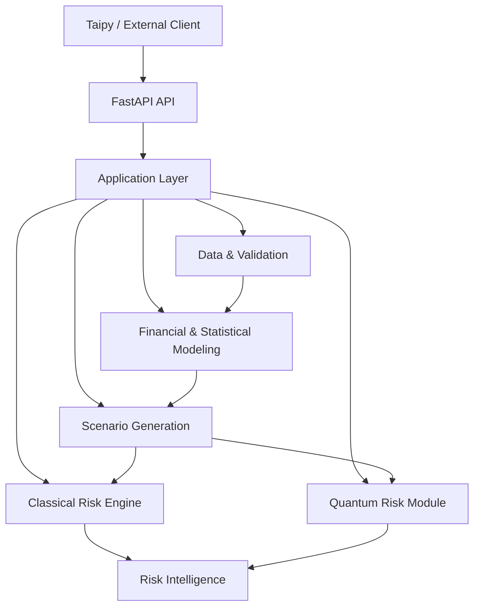

# Sigma — Architecture Diagram

> **Phiên bản:** 0.1  
> **Trạng thái:** Draft / Internal Baseline  
> **Phạm vi:** System Architecture  
> **Sản phẩm:** Sigma Risk Intelligence

---

## 1. Mục đích

Diagram này mô tả kiến trúc logic của Sigma ở mức **system architecture**.

Mục tiêu là thể hiện:

- các layer chính;
- boundary giữa UI, API, Application và Core;
- các computational domains của Sigma;
- vị trí của Classical và Quantum;
- hướng dữ liệu và dependency chính.

Chi tiết implementation thuộc `ARCHITECTURE.md`.

---

## 2. Architecture Overview



---

## 3. Layer Structure

Sigma được tổ chức theo các boundary chính:

```text
Presentation
     ↓
API
     ↓
Application
     ↓
Domain / Computational Core
     ↓
External Computational Resources
```

### Presentation

```text
Taipy / External Client
```

Chịu trách nhiệm:

- user interaction;
- visualization;
- request initiation;
- result presentation.

Không chứa financial business logic.

---

### API

```text
FastAPI
```

Chịu trách nhiệm:

- routing;
- request validation;
- response serialization;
- API contract;
- integration boundary.

Không chứa core risk algorithms.

---

### Application

```text
Application Layer
```

Chịu trách nhiệm:

- use-case orchestration;
- điều phối domain services;
- configuration;
- kết nối API với Sigma Core.

Không sở hữu domain computation nếu computation thuộc Core.

---

### Computational Core

Gồm các domain chính:

```text
Data & Validation
Financial / Statistical Modeling
Scenario Generation
Classical Risk
Quantum Risk
```

Đây là nơi financial computation được thực hiện.

---

## 4. Core Dependency Flow

Workflow dependency chính:

```text
Data
 ↓
Modeling
 ↓
Scenario Generation
 ↓
Risk Estimation
```

Risk estimation được tách thành:

```text
Scenario
   ├── Classical Risk
   └── Quantum Risk
```

Sau đó:

```text
Classical Result
        +
Quantum Result
        ↓
Risk Intelligence
```

Quantum không phải dependency bắt buộc của Classical Risk Engine.

---

## 5. Classical Risk Path

```text
Validated Data
      ↓
Financial / Statistical Modeling
      ↓
Scenario Generation
      ↓
Classical Risk Engine
      ↓
Loss Distribution
      ↓
VaR / CVaR / Stress / Risk Metrics
      ↓
Risk Intelligence
```

Classical path phải có khả năng hoạt động độc lập.

---

## 6. Quantum Risk Path

```text
Financial / Statistical Model
        ↓
Financial Quantity
        ↓
Quantum Formulation
        ↓
State Preparation
        ↓
Oracle
        ↓
Quantum Estimation
        ↓
Quantum Risk Result
        ↓
Risk Intelligence
```

Quantum module chỉ xử lý computational subproblem đã được financial formulation rõ ràng.

---

## 7. Application Boundary

Application Layer nằm giữa API và Core:

```text
FastAPI
   ↓
Application
   ↓
Sigma Core
```

Ví dụ conceptual use case:

```text
POST /risk-analysis
        ↓
Application Service
        ↓
Load / Validate Data
        ↓
Run Modeling
        ↓
Generate Scenarios
        ↓
Run Classical Risk
        ↓
Optional Quantum Risk
        ↓
Build Risk Intelligence
        ↓
API Response
```

---

## 8. External Boundary

Các thành phần bên ngoài Sigma:

```text
Market Data Provider
Portfolio / Financial Data Source
Quantum Backend
External API Client
```

Context-level relationship được mô tả trong:

```text
docs/diagrams/system-context.md
```

Quantum Backend không nằm trong Sigma Core.

```text
Sigma Quantum Module
        ↓
Quantum Backend
        ↓
Result
```

---

## 9. Architecture Principles

### Separation of Concerns

```text
UI
→ Presentation

API
→ Interface

Application
→ Orchestration

Core
→ Financial / Computational Logic
```

### Classical Independence

```text
Classical Risk
      X
   Quantum
```

Classical Risk Engine không phụ thuộc Quantum để hoạt động.

### Quantum as Enhancement

```text
Financial Problem
      ↓
Classical Baseline
      ↓
Quantum Where Justified
```

### No UI-to-Core Coupling

Không:

```text
Taipy → Direct Core Calls
```

Mà:

```text
Taipy
  ↓
FastAPI
  ↓
Application
  ↓
Core
```

### No Financial Logic in API

Không đưa:

```text
VaR
CVaR
Monte Carlo
QAE
```

trực tiếp vào API route.

---

## 10. Architecture Boundary

Tóm tắt:

```text
┌───────────────────────────────────────────────┐
│                PRESENTATION                   │
│            Taipy / External Client            │
└───────────────────────┬───────────────────────┘
                        │
┌───────────────────────▼───────────────────────┐
│                     API                       │
│                   FastAPI                     │
└───────────────────────┬───────────────────────┘
                        │
┌───────────────────────▼───────────────────────┐
│                 APPLICATION                   │
│             Use-case Orchestration            │
└───────────────────────┬───────────────────────┘
                        │
┌───────────────────────▼───────────────────────┐
│                 SIGMA CORE                    │
│                                               │
│ Data → Modeling → Scenarios                   │
│                    ↓                          │
│          ┌─────────┴─────────┐                │
│          ▼                   ▼                │
│    Classical Risk       Quantum Risk           │
│          └─────────┬─────────┘                │
│                    ▼                          │
│             Risk Intelligence                 │
└───────────────────────────────────────────────┘
```

---

## 11. North Star

> **Sigma được thiết kế như một Financial Risk Intelligence system với Classical Risk Engine làm foundation và Quantum là computational enhancement layer có boundary rõ ràng.**

Kiến trúc phải giữ được:

```text
Separation
+
Modularity
+
Classical Independence
+
Quantum Optionality
+
Financial Correctness
+
Product Integration
```
