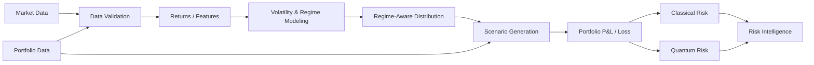

# Sigma — Data Flow

> **Phiên bản:** 0.1  
> **Trạng thái:** Draft / Internal Baseline  
> **Phạm vi:** Logical data flow  
> **Sản phẩm:** Sigma Risk Intelligence

---

## 1. Mục đích

Diagram này mô tả **dòng dữ liệu logic** trong Sigma từ market/portfolio data đến risk intelligence.

Trọng tâm:

```text
Input
→ Validation
→ Modeling
→ Distribution
→ Scenario
→ Loss
→ Risk Estimation
→ Risk Intelligence
```

Diagram không mô tả deployment hoặc infrastructure topology.

---

## 2. Data Flow Overview



---

## 3. Data Flow Stages

### 3.1. Market Data

```text
Market Data
    ↓
Data Validation
```

Có thể bao gồm:

- historical prices;
- returns;
- timestamps;
- asset identifiers;
- các market variables cần thiết.

Nguồn dữ liệu cụ thể không được hard-code trong diagram này.

---

### 3.2. Portfolio Data

Portfolio data cung cấp context để chuyển market scenarios thành portfolio risk.

```text
Portfolio
+
Weights / Holdings
+
Risk Configuration
```

Sau đó được kết hợp với scenario workflow.

---

### 3.3. Data Validation

```text
Raw / External Data
        ↓
Validation
        ↓
Validated Data
```

Kiểm tra khi phù hợp:

```text
Missing Values
Duplicates
Timestamp Ordering
Asset Identity
Frequency
Coverage
Adjustment Policy
```

Invalid data không được tiếp tục vào risk computation.

---

### 3.4. Returns / Features

```text
Validated Market Data
        ↓
Returns / Features
```

Return convention phải nhất quán trong toàn pipeline.

---

### 3.5. Volatility & Regime Modeling

```text
Returns / Features
        ↓
Volatility
        ↓
Market Regime
```

Regime là model output và phải được xem xét cùng với model assumptions.

---

### 3.6. Regime-Aware Distribution

```text
Volatility / Regime
        ↓
Distribution
```

Conceptual form:

```text
P(Return | Regime)
```

Distribution được sử dụng để tạo scenario inputs.

---

### 3.7. Scenario Generation

```text
Distribution
    +
Portfolio Context
        ↓
Scenario Set
```

Scenario có thể đến từ:

```text
Monte Carlo
Historical Scenarios
Stress Scenarios
```

Phương pháp cụ thể phụ thuộc workflow/risk analysis.

---

### 3.8. Portfolio P&L / Loss

```text
Scenario
    +
Portfolio
        ↓
Portfolio P&L
        ↓
Portfolio Loss
```

Loss convention phải được định nghĩa rõ và nhất quán.

---

## 4. Risk Estimation Branch

Sau khi có portfolio loss:

```text
Portfolio Loss
       │
       ├───────────────┐
       ▼               ▼
Classical Risk    Quantum Risk
       │               │
       └───────┬───────┘
               ▼
       Risk Intelligence
```

---

## 5. Classical Data Path

```text
Loss Distribution
        ↓
Classical Risk Engine
        ↓
VaR
CVaR / Expected Shortfall
Stress Metrics
Risk Contribution
```

Classical path là baseline của Sigma.

---

## 6. Quantum Data Path

Quantum không nhận raw market data trực tiếp.

```text
Financial Model / Risk Quantity
        ↓
Quantum Formulation
        ↓
State Preparation
        ↓
Oracle
        ↓
Quantum Estimation
        ↓
Quantum Risk Result
```

Quantum data path phụ thuộc vào computational formulation cụ thể.

Các chi phí liên quan đến:

```text
State Preparation
Oracle
Qubits
Circuit Depth
Shots
Noise
```

phải được xem xét khi benchmark.

---

## 7. Risk Intelligence Output

Classical và Quantum outputs được đưa vào:

```text
Risk Intelligence
```

Có thể bao gồm:

```text
Risk Summary
VaR
CVaR
Loss Distribution
Risk Drivers
Scenario Impact
Stress Impact
Classical–Quantum Comparison
Model / Configuration Metadata
```

---

## 8. Data Lineage

Một risk result nên có lineage:

```text
Risk Result
    ↓
Risk Analysis
    ↓
Model Configuration
    ↓
Scenario Configuration
    ↓
Validated Dataset
    ↓
Source Data
```

Mục tiêu:

```text
Result
→ Explainable
→ Traceable
→ Reproducible
```

---

## 9. Data Boundary

Data flow được chia thành các boundary:

```text
External Data
      ↓
Validation
      ↓
Modeling
      ↓
Scenario
      ↓
Risk Computation
      ↓
Risk Intelligence
```

Không để:

```text
External Data
      ↓
Direct Risk Calculation
```

---

## 10. Data Flow Principles

### Validation First

```text
Data
 ↓
Validation
 ↓
Modeling
```

### Financial Semantics First

```text
Financial Meaning
 ↓
Data Representation
 ↓
Computation
```

### Classical Baseline

```text
Loss
 ↓
Classical Risk
```

phải tồn tại trước khi dùng Quantum làm comparative path.

### Quantum as Optional Branch

```text
Loss / Financial Quantity
       │
       ├── Classical
       │
       └── Quantum (optional)
```

### No Hidden Transformation

Mọi transformation quan trọng phải có thể xác định:

```text
Input
Transformation
Output
```

---

## 11. Simplified End-to-End Flow

```text
Market Data
    +
Portfolio Data
        ↓
Data Validation
        ↓
Returns / Features
        ↓
Volatility & Regime
        ↓
Regime-Aware Distribution
        ↓
Scenario Generation
        ↓
Portfolio P&L / Loss
        ↓
┌─────────────────────┐
│                     │
▼                     ▼
Classical Risk    Quantum Risk
│                     │
└──────────┬──────────┘
           ▼
   Risk Intelligence
```

---

## 12. Boundary With Other Diagrams

```text
system-context.md
→ External systems & actors

architecture.md
→ System components & architectural boundaries

data-flow.md
→ Data movement & transformation

workflow.md
→ Operational / research workflow

deployment.md
→ Runtime / infrastructure topology
```

Mỗi diagram chỉ nên trả lời đúng câu hỏi của nó.

---

## 13. North Star

> **Sigma chuyển dữ liệu tài chính thành risk intelligence thông qua một pipeline có thể truy nguyên, kiểm chứng và benchmark được.**

```text
Data
 ↓
Model
 ↓
Scenario
 ↓
Loss
 ↓
Risk
 ↓
Intelligence
```
