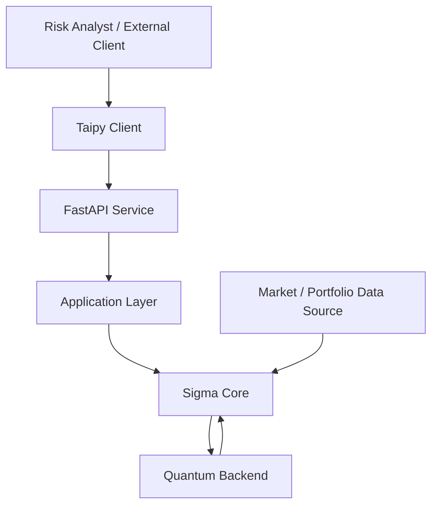

# Sigma — Deployment Diagram

> **Phiên bản:** 0.1  
> **Trạng thái:** Draft / Internal Baseline  
> **Phạm vi:** Runtime / Deployment Architecture  
> **Sản phẩm:** Sigma Risk Intelligence

---

## 1. Mục đích

Diagram này mô tả **các runtime components chính và ranh giới triển khai** của Sigma.

Mục tiêu:

- phân biệt client, API, application và computational core;
- thể hiện vị trí của Quantum Backend;
- giữ deployment V1 đơn giản;
- không tạo infrastructure chỉ để “trông enterprise”.

Deployment topology cụ thể có thể thay đổi khi workload và production requirements rõ hơn.

---

## 2. Deployment Overview



---

## 3. Runtime Components

### Client

```text
Risk Analyst
External API Consumer
```

Tương tác với Sigma thông qua:

```text
Taipy
API
```

---

### Taipy Client

Taipy là reference presentation client V1.

```text
Taipy
   ↓
HTTP / API
   ↓
FastAPI
```

Taipy không chứa financial computation.

---

### FastAPI Service

FastAPI là application-facing API boundary.

```text
Client
  ↓
FastAPI
  ↓
Application
```

Chịu trách nhiệm:

- request handling;
- validation;
- serialization;
- API contract;
- integration.

---

### Application Layer

Application layer điều phối use cases:

```text
API
 ↓
Application
 ↓
Sigma Core
```

Nó không phải một infrastructure service độc lập bắt buộc phải deploy riêng trong V1.

---

### Sigma Core

Sigma Core chứa:

```text
Data
Modeling
Scenario Generation
Classical Risk
Quantum Risk
Risk Intelligence
```

V1 ưu tiên triển khai Core như một logical modular core thay vì tách thành nhiều microservices.

---

### Market / Portfolio Data Source

Data có thể đến từ:

```text
Market Data Provider
Portfolio / Financial Data
```

Data source cụ thể không bị khóa trong deployment diagram.

---

### Quantum Backend

Quantum Backend là external computational resource:

```text
Sigma Core
    ↓
Quantum Backend
```

Có thể là:

```text
Ideal Simulator
Noisy Simulator
Quantum Hardware
```

Quantum backend không phải dependency bắt buộc để Classical Risk Engine hoạt động.

---

## 4. V1 Deployment Model

V1 nên ưu tiên mô hình đơn giản:

```text
Client
  ↓
FastAPI
  ↓
Application
  ↓
Sigma Core
```

Quantum có thể nằm ngoài runtime chính:

```text
Sigma Core
    ↓
Quantum Backend
```

Conceptually:

```text
┌─────────────────────────────────────────┐
│              Sigma Runtime              │
│                                         │
│  FastAPI                                │
│     ↓                                   │
│  Application                            │
│     ↓                                   │
│  Sigma Core                             │
│                                         │
│  Data / Modeling / Risk / Quantum       │
└──────────────────┬──────────────────────┘
                   │
                   ▼
          External Quantum Backend
```

---

## 5. Classical-Only Deployment

Sigma phải có khả năng hoạt động mà không cần Quantum Backend:

```text
Client
  ↓
FastAPI
  ↓
Application
  ↓
Sigma Core
  ↓
Classical Risk
  ↓
Risk Intelligence
```

Nếu Quantum backend unavailable:

```text
Quantum unavailable
        ↓
Classical path remains available
```

---

## 6. Quantum-Enabled Deployment

Khi Quantum được sử dụng:

```text
Client
  ↓
FastAPI
  ↓
Application
  ↓
Sigma Core
  ↓
Quantum Module
  ↓
Quantum Backend
```

Kết quả quay về:

```text
Quantum Backend
      ↓
Quantum Module
      ↓
Risk Intelligence
```

---

## 7. Deployment Boundary

### Sigma-controlled

```text
FastAPI
Application
Sigma Core
```

### External

```text
Market Data Provider
Quantum Backend
External Client
```

### Presentation

```text
Taipy
```

Taipy có thể được triển khai cùng hoặc tách khỏi API service tùy deployment target, nhưng logical boundary vẫn giữ:

```text
Taipy
  ↓
API
```

---

## 8. Deployment Principles

### Modular Monolith First

V1 ưu tiên:

```text
One Repository
+
One Logical Core
+
Clear Module Boundaries
```

Không mặc định tách:

```text
Risk Service
Scenario Service
Quantum Service
Data Service
```

thành các microservice độc lập.

---

### Stateless API Where Practical

FastAPI nên giữ application/API layer càng stateless càng tốt.

State dài hạn hoặc persistence chỉ được bổ sung khi có requirement rõ ràng.

---

### Quantum Optionality

```text
Quantum Backend
       │
       ├── Available → Quantum path
       │
       └── Unavailable → Classical path
```

Không để deployment của Quantum phá vỡ Classical Risk workflow.

---

### Infrastructure on Demand

Không thêm:

```text
Kubernetes
Kafka
Redis
Celery
Airflow
Prefect
```

chỉ vì deployment diagram có vẻ “enterprise” hơn.

Chỉ đưa infrastructure mới vào khi workload hoặc operational requirement thực sự yêu cầu.

---

## 9. Development Deployment

Development có thể đơn giản:

```text
Developer Machine
│
├── Taipy
├── FastAPI
├── Sigma Core
├── Local Data
└── Quantum Simulator
```

Ví dụ:

```text
Taipy
  ↓
FastAPI
  ↓
Sigma Core
  ↓
Qiskit Aer
```

Không cần distributed infrastructure cho development V1.

---

## 10. Future Production Direction

Khi production requirements xuất hiện, deployment có thể tiến hóa thành:

```text
Client
   ↓
API / Gateway
   ↓
Sigma Application
   ↓
Sigma Core
   ├── Data / Modeling
   ├── Classical Risk
   └── Quantum
          ↓
   Quantum Backend
```

Có thể bổ sung:

```text
Persistence
Observability
Authentication
Authorization
Secrets Management
Job Execution
External Data Connectors
```

nhưng chỉ khi có requirement thực tế.

---

## 11. Deployment vs Architecture

```text
architecture.md
→ Logical system structure

deployment.md
→ Where runtime components execute
```

Do đó deployment diagram không quyết định:

```text
Financial Methodology
Risk Model
Quantum Algorithm
Data Schema
```

Nó chỉ mô tả runtime/deployment boundary.

---

## 12. North Star

> **Sigma V1 ưu tiên một deployment đơn giản, modular và dễ vận hành; Quantum được tích hợp như một computational resource mà không làm mất tính độc lập của Classical Risk Engine.**

```text
Simple
+
Modular
+
Observable
+
Reproducible
+
Quantum-Optional
```
