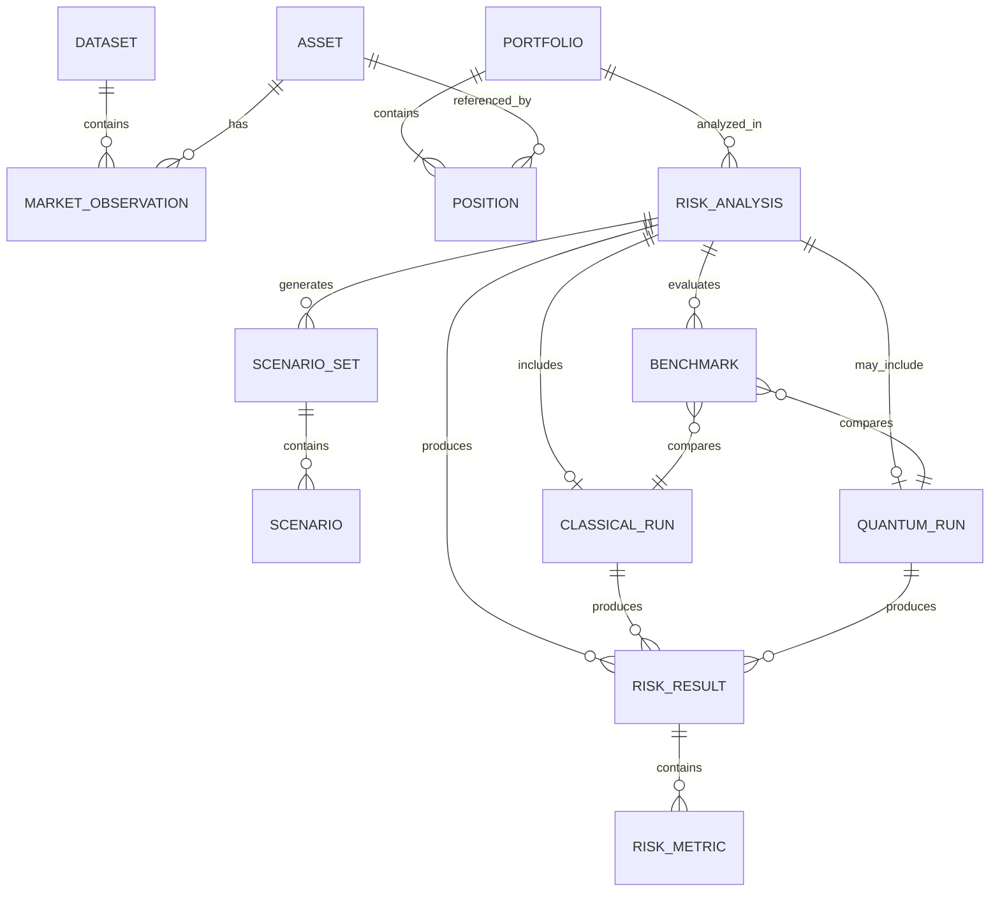

# Sigma — Entity Relationship Diagram

> **Phiên bản:** 0.1  
> **Trạng thái:** Draft / Internal Baseline  
> **Phạm vi:** Logical data relationships  
> **Sản phẩm:** Sigma Risk Intelligence

---

## 1. Mục đích

Diagram này mô tả các **entity logic chính** trong Sigma và quan hệ giữa chúng.

Mục tiêu:

```text
Market Data
→ Portfolio
→ Analysis
→ Scenario
→ Risk Result
→ Benchmark
```

Diagram này không phải physical database schema. Chi tiết field và type thuộc `SCHEMA.md`.

---

## 2. Entity Relationship Overview



---

## 3. Core Entities

### DATASET

Đại diện cho một tập dữ liệu được sử dụng trong analysis.

Ví dụ:

```text
Market price dataset
Return dataset
Research dataset
```

Quan hệ:

```text
DATASET
   ↓
MARKET_OBSERVATION
```

Dataset phải có provenance và context phù hợp.

---

### MARKET_OBSERVATION

Một observation của market data tại một thời điểm.

Có thể chứa:

```text
Asset
Timestamp
Price / Market Value
Volume hoặc biến liên quan khi cần
```

---

### ASSET

Đại diện cho financial instrument được Sigma phân tích.

Ví dụ:

```text
Equity
ETF
Index
Other supported instrument
```

`ASSET` được tham chiếu bởi cả market observation và portfolio position.

---

### PORTFOLIO

Đại diện cho portfolio được phân tích.

Portfolio có:

```text
Positions
Weights / Exposure
Analysis Context
```

Quan hệ:

```text
PORTFOLIO
    ↓
POSITION
```

---

### POSITION

Đại diện cho exposure của một asset trong portfolio.

```text
Portfolio
    +
Asset
    +
Quantity / Weight / Exposure
```

---

### RISK_ANALYSIS

Đại diện cho một lần phân tích risk cụ thể.

Có thể chứa context như:

```text
Portfolio
Valuation Date
Risk Horizon
Confidence Level
Model Configuration
Scenario Configuration
```

Đây là entity trung tâm của risk-analysis workflow.

---

### SCENARIO_SET

Đại diện cho tập scenario được tạo trong một analysis.

```text
RISK_ANALYSIS
       ↓
SCENARIO_SET
       ↓
SCENARIO
```

Scenario set phải gắn với methodology/configuration phù hợp.

---

### SCENARIO

Đại diện cho một scenario cụ thể.

Scenario có thể đến từ:

```text
Monte Carlo
Historical Scenario
Stress Scenario
```

---

### CLASSICAL_RUN

Đại diện cho một execution của Classical Risk Engine.

Có thể lưu:

```text
Method
Configuration
Runtime
Sampling Information
Result Metadata
```

Classical run là baseline cho Quantum benchmark.

---

### QUANTUM_RUN

Đại diện cho một execution của Quantum Risk Module.

Có thể lưu:

```text
Algorithm
Backend
Qubits
Circuit Depth
Shots
Oracle Information
State Preparation Information
Runtime
Noise Configuration
```

Quantum run là optional.

---

### RISK_RESULT

Đại diện cho output risk của một execution.

Ví dụ:

```text
VaR
CVaR / Expected Shortfall
Expected Loss
Stress Loss
Risk Contribution
```

---

### RISK_METRIC

Đại diện cho một metric cụ thể trong risk result.

Ví dụ:

```text
VaR 95%
VaR 99%
CVaR 95%
CVaR 99%
```

Metric phải có context đủ để hiểu:

```text
Horizon
Confidence Level
Method
Configuration
```

---

### BENCHMARK

Đại diện cho một Classical–Quantum comparison.

Benchmark phải gắn với cùng financial problem và context phù hợp.

Conceptual relationship:

```text
Classical Run
      +
Quantum Run
      ↓
Benchmark
```

---

## 4. Relationship Summary

### Dataset → Market Observation

```text
DATASET
   1
   │
   └── N MARKET_OBSERVATION
```

Một dataset có thể chứa nhiều observations.

---

### Asset → Market Observation

```text
ASSET
  1
  │
  └── N MARKET_OBSERVATION
```

Một asset có nhiều observations theo thời gian.

---

### Portfolio → Position

```text
PORTFOLIO
    1
    │
    └── N POSITION
```

Một portfolio có nhiều positions.

---

### Portfolio → Risk Analysis

```text
PORTFOLIO
    1
    │
    └── N RISK_ANALYSIS
```

Một portfolio có thể được phân tích nhiều lần với các configuration khác nhau.

---

### Risk Analysis → Scenario Set

```text
RISK_ANALYSIS
      1
      │
      └── N SCENARIO_SET
```

Một analysis có thể tạo nhiều scenario sets tùy workflow.

---

### Scenario Set → Scenario

```text
SCENARIO_SET
      1
      │
      └── N SCENARIO
```

---

### Risk Analysis → Execution

```text
RISK_ANALYSIS
      │
      ├── CLASSICAL_RUN
      │
      └── QUANTUM_RUN (optional)
```

Classical run là baseline; Quantum run là optional.

---

### Execution → Risk Result

```text
CLASSICAL_RUN ──┐
                ├──> RISK_RESULT
QUANTUM_RUN ────┘
```

---

### Risk Result → Risk Metric

```text
RISK_RESULT
    1
    │
    └── N RISK_METRIC
```

---

### Risk Analysis → Benchmark

```text
RISK_ANALYSIS
      1
      │
      └── N BENCHMARK
```

Benchmark thuộc về một analysis context.

---

## 5. Logical Relationship Model

Tổng quát:

```text
DATASET
   ↓
MARKET_OBSERVATION
   ↑
 ASSET

PORTFOLIO
   ↓
POSITION
   ↓
 ASSET

PORTFOLIO
   ↓
RISK_ANALYSIS
   ↓
SCENARIO_SET
   ↓
SCENARIO
   ↓
┌───────────────┐
│               │
▼               ▼
CLASSICAL_RUN  QUANTUM_RUN
│               │
└───────┬───────┘
        ▼
   RISK_RESULT
        ↓
   RISK_METRIC

CLASSICAL_RUN
      +
QUANTUM_RUN
      ↓
 BENCHMARK
```

---

## 6. Important Boundaries

### ERD vs Schema

```text
er.md
→ Entity + Relationship

SCHEMA.md
→ Field + Type + Constraint + Semantics
```

ERD không thay thế schema specification.

---

### Logical vs Physical

ERD này không quyết định:

```text
Database Engine
Table Partitioning
Indexes
Storage Format
ORM Mapping
Deployment
```

Các quyết định physical chỉ được đưa ra khi có requirement phù hợp.

---

## 7. Data Integrity Principles

Các relationship quan trọng phải bảo đảm:

```text
Asset Identity
Timestamp Consistency
Portfolio Integrity
Analysis Context
Scenario Traceability
Risk Result Traceability
Benchmark Context
```

Một risk result phải có khả năng truy nguyên về analysis context của nó.

Conceptual lineage:

```text
Risk Metric
    ↓
Risk Result
    ↓
Execution
    ↓
Risk Analysis
    ↓
Portfolio / Scenario / Model Configuration
```

---

## 8. Quantum Data Boundary

`QUANTUM_RUN` không có nghĩa toàn bộ dataset được đưa trực tiếp vào quantum circuit.

Workflow logic vẫn là:

```text
Market Data
    ↓
Financial Modeling
    ↓
Financial Quantity
    ↓
Quantum Formulation
    ↓
QUANTUM_RUN
    ↓
RISK_RESULT
```

State preparation và encoding phải được xem xét như một phần của Quantum execution context khi benchmark.

---

## 9. North Star

> **ERD của Sigma mô tả cách financial data, portfolio, analysis, scenario và risk results liên kết với nhau để tạo thành một risk analysis có thể truy nguyên và benchmark được.**

```text
Data
 ↓
Portfolio
 ↓
Analysis
 ↓
Scenario
 ↓
Execution
 ↓
Risk Result
 ↓
Benchmark
```
