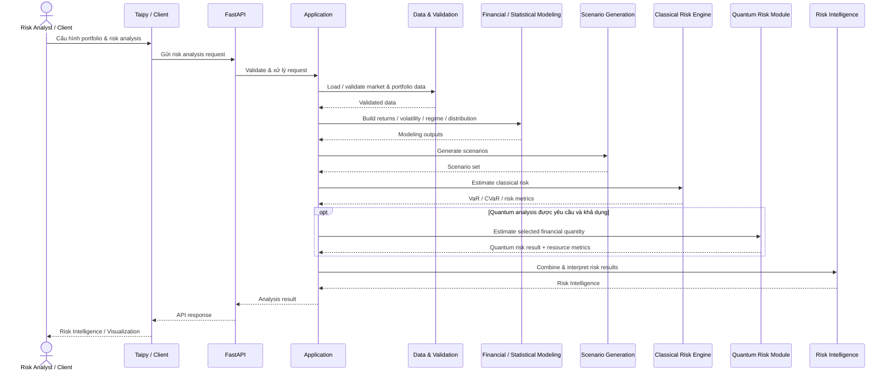
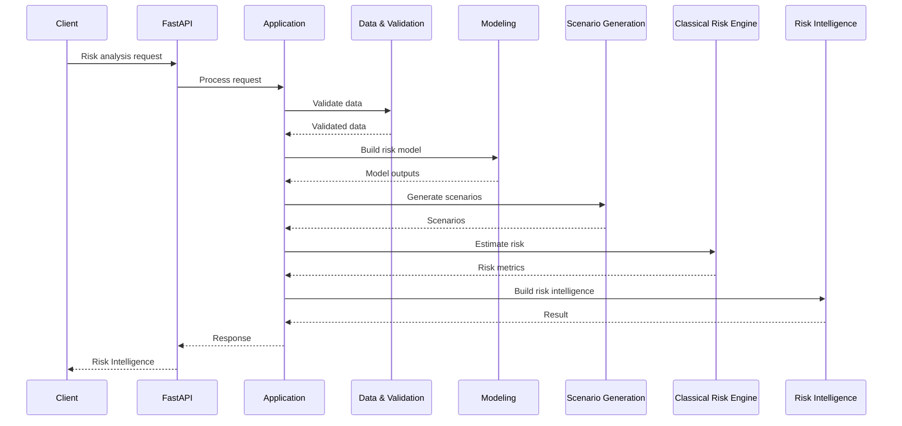
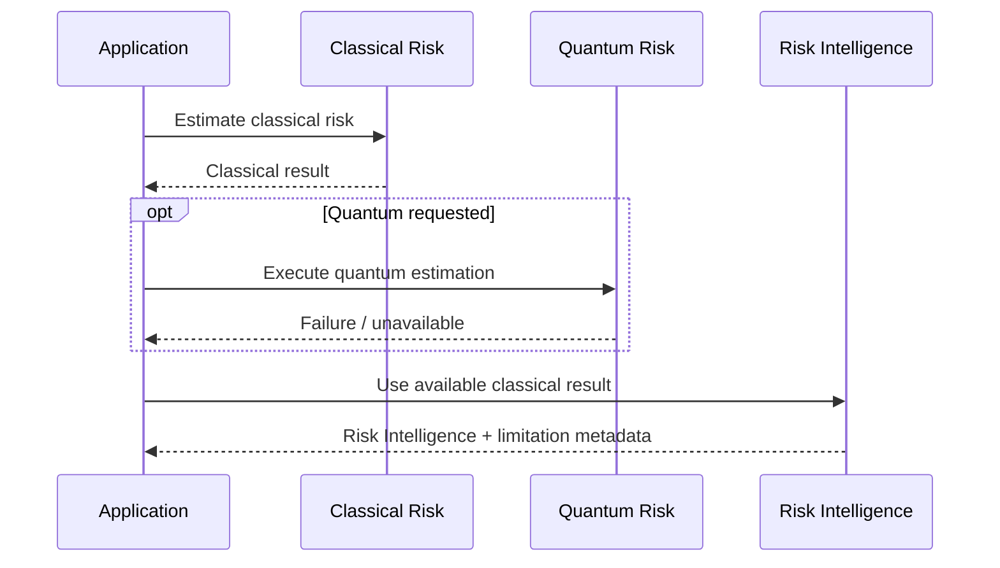
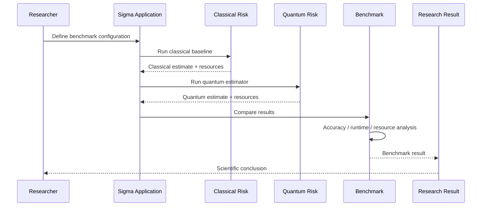

# Sigma — Sequence Diagram

> **Phiên bản:** 0.1  
> **Trạng thái:** Draft / Internal Baseline  
> **Phạm vi:** Risk analysis request sequence  
> **Sản phẩm:** Sigma Risk Intelligence

---

## 1. Mục đích

Diagram này mô tả **trình tự xử lý của một risk analysis request** từ client đến Sigma và ngược lại.

Trọng tâm:

```text
Request
→ Validation
→ Modeling
→ Scenario
→ Risk Estimation
→ Risk Intelligence
→ Response
```

Diagram không mô tả deployment topology hoặc chi tiết implementation nội bộ.

---

## 2. Risk Analysis Sequence



---

## 3. Sequence Stages

### 3.1. Request

```text
User
 ↓
UI / Client
 ↓
FastAPI
```

Request có thể chứa:

```text
Portfolio
Risk Horizon
Confidence Level
Analysis Configuration
Scenario Configuration
Quantum Option
```

---

### 3.2. Validation

```text
FastAPI
 ↓
Application
 ↓
Data & Validation
```

Sigma không chạy risk computation trên dữ liệu chưa được validation.

---

### 3.3. Financial Modeling

```text
Validated Data
 ↓
Returns
 ↓
Volatility
 ↓
Regime
 ↓
Distribution
```

Modeling output trở thành input cho scenario generation.

---

### 3.4. Scenario Generation

```text
Distribution
+
Portfolio Context
 ↓
Scenario Set
```

Scenario method có thể là:

```text
Monte Carlo
Historical Scenario
Stress Scenario
```

tùy analysis.

---

### 3.5. Classical Risk

```text
Scenario Set
 ↓
Portfolio Loss
 ↓
Classical Risk Engine
 ↓
VaR / CVaR / Risk Metrics
```

Classical path luôn là baseline.

---

### 3.6. Quantum Risk

Quantum chỉ được gọi khi:

```text
Quantum Analysis Requested
+
Quantum Backend Available
+
Financial Quantity Formulated
```

Sequence:

```text
Application
 ↓
Quantum Risk Module
 ↓
State Preparation
 ↓
Oracle
 ↓
Quantum Estimation
 ↓
Quantum Result
```

Quantum không thay thế Classical Risk Engine trong sequence V1.

---

### 3.7. Risk Intelligence

```text
Classical Result
        +
Quantum Result (optional)
        ↓
Risk Intelligence
```

Output có thể bao gồm:

```text
Risk Summary
VaR
CVaR
Risk Drivers
Scenario Impact
Stress Impact
Classical–Quantum Comparison
```

---

## 4. Classical-Only Sequence

Nếu Quantum không được yêu cầu hoặc không khả dụng:



Classical Risk Analysis vẫn hoạt động độc lập.

---

## 5. Quantum-Enhanced Sequence

Khi Quantum được kích hoạt:

```text
Classical Modeling
        ↓
Scenario / Financial Quantity
        ↓
Classical Risk Baseline
        +
Quantum Estimation
        ↓
Benchmark / Comparison
        ↓
Risk Intelligence
```

Quantum branch là optional.

---

## 6. Failure / Fallback

Nếu Quantum không khả dụng:



Không được tạo hoặc suy diễn Quantum result khi execution thất bại.

---

## 7. Benchmark Sequence

Khi research benchmark được thực hiện:



Benchmark phải giữ cùng financial problem và context phù hợp.

---

## 8. Sequence Boundaries

```text
Client
  ↓
API
  ↓
Application
  ↓
Core
  ├── Data
  ├── Modeling
  ├── Scenario
  ├── Classical Risk
  └── Quantum Risk
  ↓
Risk Intelligence
```

UI không gọi trực tiếp Core.

Quantum không bypass Application.

Classical Risk không phụ thuộc Quantum.

---

## 9. Sequence Principles

### Validation First

```text
Request
 ↓
Validation
 ↓
Computation
```

### Classical First

```text
Classical Baseline
 ↓
Quantum Comparison
```

### Quantum Optional

```text
Quantum Available?
   ├── No  → Classical
   └── Yes → Classical + Quantum
```

### No Hidden Failure

Nếu một branch thất bại, trạng thái phải được phản ánh trong result metadata.

### No Fake Result

Không sinh kết quả từ một computation chưa thực sự chạy.

---

## 10. North Star

> **Một risk analysis request phải đi qua một sequence có thể truy nguyên từ request → data → model → scenario → risk → intelligence → response.**

```text
Request
  ↓
Validate
  ↓
Model
  ↓
Scenario
  ↓
Risk
  ↓
Benchmark (optional)
  ↓
Risk Intelligence
  ↓
Response
```
