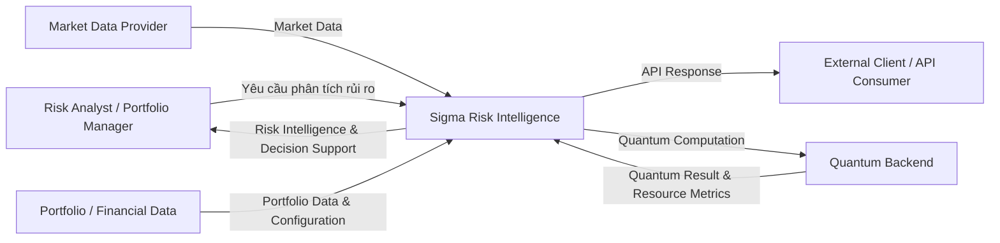

# Sigma — System Context

> **Phiên bản:** 0.1  
> **Trạng thái:** Draft / Internal Baseline  
> **Phạm vi:** System Context  
> **Sản phẩm:** Sigma Risk Intelligence

---

## 1. Mục đích

Diagram này mô tả Sigma ở **mức system context**:

- Sigma là hệ thống nào;
- ai tương tác với Sigma;
- Sigma nhận và cung cấp gì;
- các hệ thống bên ngoài nào có quan hệ với Sigma.

Diagram này **không mô tả internal modules** như Risk Engine, Quantum Engine hay Data Layer. Các chi tiết đó thuộc `ARCHITECTURE.md` và các diagram cấp thấp hơn.

---

## 2. System Context



---

## 3. Actors & External Systems

| Thành phần | Vai trò |
|---|---|
| Risk Analyst / Portfolio Manager | Sử dụng Sigma để phân tích portfolio risk và scenario |
| Market Data Provider | Cung cấp market data phục vụ financial modeling |
| Portfolio / Financial Data | Cung cấp holdings, weights và analysis configuration |
| Quantum Backend | Cung cấp simulator hoặc quantum hardware |
| External Client / API Consumer | Tích hợp Sigma thông qua API |
| Sigma Risk Intelligence | Hệ thống trung tâm thực hiện risk analysis và cung cấp decision support |

---

## 4. Primary Interaction

```text
Portfolio
    +
Analysis Configuration
        ↓
Sigma
        ↓
Risk Intelligence
```

Risk Intelligence có thể bao gồm:

```text
Risk Summary
Risk Drivers
Loss Distribution
VaR
CVaR
Stress Results
Scenario Analysis
Classical–Quantum Benchmark
```

---

## 5. External Data Context

Sigma không khóa vào một market-data vendor duy nhất.

```text
Market Data Provider
        ↓
Sigma Data Boundary
        ↓
Validated Financial Data
```

Data source có thể thay đổi theo:

- availability;
- data quality;
- license;
- cost;
- project stage.

---

## 6. Quantum Context

Quantum là một **external computational resource** trong system context.

```text
Sigma
   ↓
Quantum Backend
   ↓
Quantum Result
```

Backend có thể là:

```text
Ideal Simulator
Noisy Simulator
Quantum Hardware
```

Sigma phải phân biệt các execution environment này trong benchmark và result metadata.

Quantum không phải dependency bắt buộc để Classical Risk Analysis hoạt động.

```text
Quantum unavailable
        ↓
Classical Risk Analysis
        ↓
Risk Intelligence vẫn hoạt động
```

---

## 7. API Context

Sigma có thể được tích hợp bởi hệ thống bên ngoài:

```text
External Client
      ↓
Sigma API
      ↓
Risk Intelligence
      ↓
External Client
```

API là integration boundary.

External client không cần biết implementation details bên trong Sigma.

---

## 8. Context Boundary

### Bên trong Sigma

```text
Sigma Risk Intelligence
```

### Bên ngoài Sigma

```text
Users
Market Data Providers
Portfolio / Financial Data Sources
Quantum Backends
External API Consumers
```

System Context diagram **không mở rộng** vào:

```text
Data Layer
Modeling Layer
Scenario Engine
Classical Risk Engine
Quantum Module
Application Layer
UI Layer
```

Các thành phần này thuộc system architecture và sẽ được mô tả ở các diagram khác.

---

## 9. System Context Principle

Sigma đứng giữa:

```text
Financial Data
        +
User / Client
        +
Computational Resources
```

và chuyển chúng thành:

```text
Risk Intelligence
        +
Decision Support
```

Tổng quát:

```text
         Market / Portfolio Data
                  │
                  ▼
User / Client → SIGMA ← Quantum Backend
                  │
                  ▼
          Risk Intelligence
                  │
                  ▼
           Decision Support
```

---

## 10. North Star

> **Sigma là một Financial Risk Intelligence system, không phải một Quantum Computing system.**

Quantum Backend là computational resource được Sigma sử dụng khi phù hợp với financial problem và có thể được benchmark một cách công bằng.
